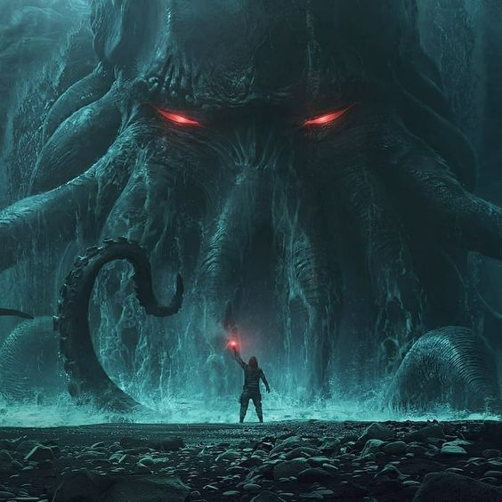
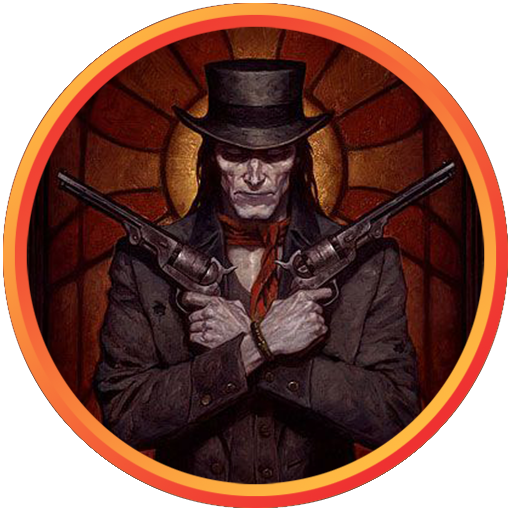
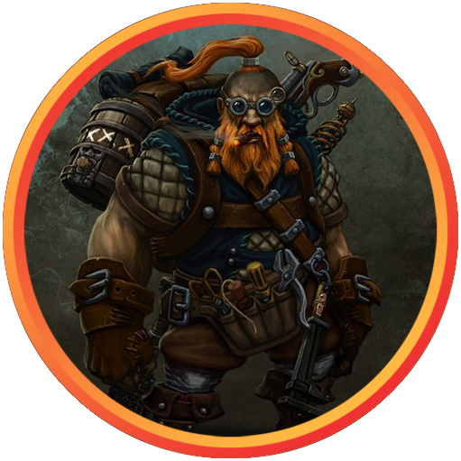
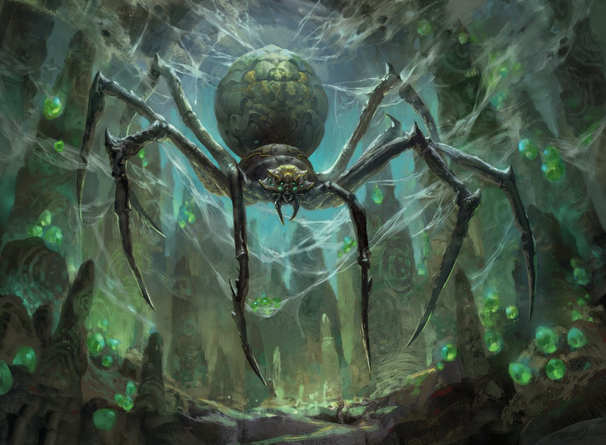
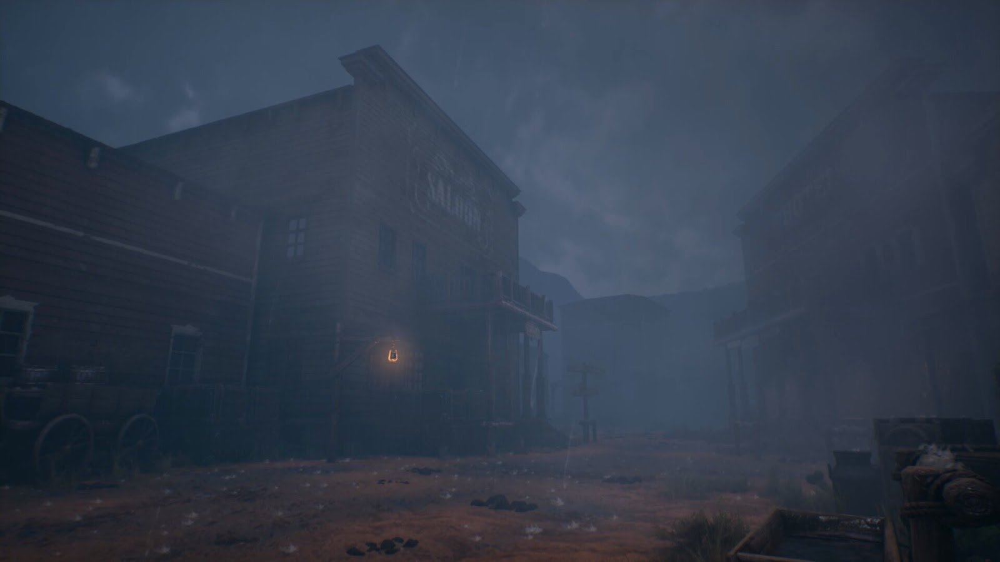
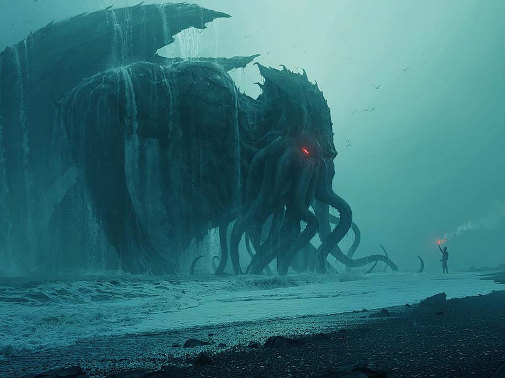

# Abbey in the Mist

## Summary
This is a one-shot adventure inspired by “The Mist” by Stephen King. The players walk through a small western town when an impenetrable cloud of sinister mist envelops the streets. They and the other citizens hide from the Mist in the nearby Abbey. They need to find the source of the mist (a portal opened by the evil cult) and destroy it before the ancient eldritch deity (The One Who Tumbles) comes out of it and takes over our world.p

## Characters

 

### The One Who Tumbles

An ancient eldritch entity. Spreads through the multiverse, taking over one universe after another. Brings with it the monsters and the mist.

### Archibald

 

The town's sheriff, secretly the leader of "The Children of the Mist" - a cult worshiping The One Who Tubles. Obsessed with bringing him into our world, to “cleanse it of the impure”, also hoping to be rewarded when he comes. 

### Gregory Gear

 
A brilliant artificer. He was managing the construction of the teleportation gate to bring trade into the town, currently mind-controlled by the cult, influenced to change the construction of the gate to turn it into The Portal instead. If released from the mind-control will help players to learn the nature of the mist and how to close the portal.

### Sentient Spiders

Huge sentient spiders, lay their eggs inside people, but aren’t hostile - can be reasoned and negotiated with.

Players can communicate with them telepathically, to get the flashes of alien thoughts telling them about life in other dimensions.

<!-- 
### The Monsters

 
The creatures that came out of the portal - huge spiders, giant insects, dinosaur-type things. Much too powerful for players to fight, you can only hide from them, run from them, sneak past them, sacrifice one of the citizens to them to distract them.
 -->

## Backstory
Gregory Gear, a brilliant artificer, was building a teleportation gate to establish the trade between the town and the rest of the world. Archibald and his cult have attacked Gregory, put him under mind control spell, and forcedh im to corrupt the teleportation gate, make it so that it opens the portal to The Realm of Nightmares - a plane where The One Who Tumbles lives and can be summoned from. 

The portal has been opened and the Mist and the monsters came in through it. The ritual began around the time the players have arrived into town, and will be complete in a few hours, at which point The One Who Tumbles will be birthed into the world, take over our planet, and turn it into the Realm of Nightmares.

# Scenes

## The Mist Arrives
The players arrive in a small western town following an unrelated quest (delivering a package, or taking a break between adventures).

They see a wall of mist enveloping the street. They see a citizen trying to run away from the mist, screaming for everyone to run, and immediately getting murdered by a huge tentacle coming out of it.

They hide in the nearby Abbey with the town’s citizens. Archibald (the sheriff) immediately gets control of the situation, starts giving villagers orders, tells everyone to stay inside. They also see Gregory Gear, looking strangely blank and spaced out (he's being controlled by the cross-shaped amulet on the Archibald's neck).

Players can notice Archibald's amulet or Gregory's strange behavior, and if they will try to investigate - Archibald will become increasingly hostile. Archibald will do his best to prevent people from leaving the Abbey, to make sure that noone interrupts the summoning ritual for the One Who Tumbles. He will try to turn the citizens against the players, possibly resorting to violence.

If the players manage to get a hold of the amulet or defeat Archibald and liberate Gregory, Gregory will tell them the story about how he got mind-controlled and forced to open the portal. He will also tell them about the location of the portal - in the Canyon next to the town.

## Escape the Abbey
The Abbey will be attacked by gigantic monsters from time to time - gigantic insects and pterodactyl-like birds smashing through the windows, dinosaur-sized abominations bumping into the walls making the building shake, mist seeping in making everyone who breathes it in feel fear/insanity/rage.

By the time the situation with Archibald is resolved, the building is about to crumble. Players can escape the Abbey through the underground tunnels that lead to a nearby crypt in the cemetery.

## Spiders in the Crypt
Inside the crypt players will see a nest of sentient spiders planting their eggs into the several captured townspeople. The spiders aren't hostile, that's just their way of life. They can communicate telepathically, by sending visual images of their thoughts to the players. Players can find a way to negotiate with them, or defeat them in battle.

After the crypt, the players will need to make their way to the trainstation nearby, as it is the fastest way to reach the location of the Portal.

## Encounters in the Mist

As players are making their way through the Mist, they can encounter monsters and various dangers:
- An underground creature causes the ground to rumble and show its movement. As it approaches, the party must find a way to not be on the ground to avoid being seen.
- A large creature shakes the ground as it approaches, but it only senses movement. The party must remain still in order to not be seen.
- A little girl is found running around looking for her parents. Her eyes have become glazed over and she’s blind. She must be returned to town and put into the orphanage. If with the party for more than two hours in the mist they lose her as she wanders away in an unknown direction.
- An Owlbear with human legs has gained consciousness. He’s a wanderer, and asks the party for the direction of the town. When returning to the town, he thanks the party and gifts them a good sum.
- A mystic studying the mist has made a tent with a protective force field surrounding. The players can interview him, but while walking away the tent gets sucked underground and destroyed only to have the ground it was on heal.
- A tribe of small creatures (think crabs, lizards) has made a functioning civilization. They can’t communicate with the party without a spell, but they’re lively and carry a good amount of intelligence.
- A human with his bottom half chopped off has survived due to the mist’s random powers. He’s in constant pain, but keeps walking with his hands as it’s all he can do.
- A benign floating bobcat appears before the party, offering fortune-cookie-like insights. Later, when the party is sleeping, the bobcat appears in all of their dreams. Although he didn’t mention a name, all different party members remember a different name for the bobcat.
- A murder of crows flies directly at the party. When they get within 5 feet of the party, the crows turn into flapping pieces of paper. When they exit that range, they turn back into crows. If a member of the party grabs one of the pieces of paper it’s a birthday card. On the outside is an illustration of a Vrock with the caption, “Are you a Vrock?” On the inside it reads, “... Because you’re getting up there! Happy 67th birthday, Jointoy! -Your favorite grandson, Marctim”
- A ballet dancer jumps through the mist in front of the party. The closer they get, the more transparent the dancer gets.
- A thunderstorm strikes through the sky, eventually sending a lightning bolt directly in front of the party 20 feet. It destroys a small portion of the ground and creates a hole, out of which crawls swarms of fast worms. If standing too close, the player must shake off all the worms crawling up them.
- The players walk into a small destroyed village. When attempting to walk out of the village, the rubble continues forever. This stops when a player tries to physically interact with any of the rubble or objects, at which point all of the buildings fade away.
- Two goblin children chase each other through the mist before opening a previously invisible door in the ground. When opened by the goblin child, it appears to look like a library. If a player opens the door, it becomes a geyser and spews hot water 50 feet into the air. A player must, using all of its strength, force the door back closed. When finally closed, it screams in pain and shrinks until molecular and invisible.
- The party comes across an elderly wood elf hunched over on a stool in front of an easel painting an impressionist painting of the mist. When closely inspected, his skin seems to be deteriorating and tearing at stress points. When talked to he says, “Please leave me be. I have less than a day left,” and doesn’t respond to anything past that.
- Two bugbears with hawaiian shirts and beige bucket hats, a husband and a wife, approach the party with a map in hand. The husband asks which way the ballet dancer is. When given an answer, they thank the party and walk in the given direction.
- The players feel their ears fill with masses of tiny spheres. In seconds, those spheres hatch and swarms of miscellaneous insects (think Oogie Boogie from The Nightmare before Christmas). The players must continually fight to keep their cool while also pushing the bugs and eggs out of their heads.
- The sound of a fiddle playing a song rings across the mist. It lasts for the duration of the song (about three minutes). 
- A huge chicken leg comes down from the sky and walks across the ground. The players can only see one step, the foot and ankle about to press down onto their general location. The players must dodge the foot before it steps. If a player fails, they’re flattened, shrinking to two-dimensionality like a pancake. They waddle in a circle for three seconds before bouncing back into their normal form.
- The players begin to float, drifting as high as eight feet off the ground. After seven seconds, they’re launched at the ground. The ground takes on a bouncy-house and bounces the players quality before landing them safely on solid ground.
- An injured man in torn clothes stained with his own blood stumbles out of the mist, falling onto the frontmost player. He begins to stammer in an attempt to explain what was happening, pointing behind him. Within seconds a pink beam of arcane energy bolts out of where he was pointing and hits the man directly in the head, killing him instantly without making any physical impact. In the same direction a man can be heard mounting a horse, saying “upward,” and then riding the horse into the sky as the galloping rises.
- Hundreds of miniature trains rush across the ground, as the players must jump and dance around them to avoid being tripped.
- A slick-1950s-talking bobcat appears before the party, reading a book. The bobcat is unresponsive but quick and witty with his shutdowns, saying things like “Nah slick, you don’t WANT to know what I'M reading’, you copy?” or “I’m sorry slick, I ain't got no words for you. Scram!” Seconds after the players decide to cease interaction with the bobcat, the book vanishes into thin air and the bobcat begins floating upwards. Once suspended 15 feet, the bobcat says finally, “I’ll be back, slick,” before disappearing in the blink of an eye as if erased from history.
- A bald man alone on a canoe drifts through the ground, which around him has the property of water and allows him to push through very easily. He only looks forward towards where he’s going. The party must get out of his way or else get hit by the canoe and get a leg injury.
- An elderly kobold dressed in a homemade mole costume emerges from a dug hole in the ground. He has a very high-pitched voice and asks the party where the nearest bank is. He then burrows back underground and digs in the suggested direction.
- Blipping into the plane directly in front of the party is a mother and a father dressed in formalwear. They’re heavily injured and they’re covered in blood. They crawl to the party and beg for the location of their daughter, as if the players must know where she is. A minute later they blip away.

## Reach the Portal

Eventually the players will reach the train station, and take the train to the location of the portal - next to the river running through a canyon.

 

They will need to run through the Canyon filled with the mist and the monsters, and reach the Portal before the summoning ritual is complete.

## Stop the Ritual

By the time they reach the portal, The One Who Tumbles is already half the way out of the portal. The players will need to reach and destroy a large energy crystal supporting the portal. Once it is destroyed, the portal will begin to close, killing The One Who Tumbles in the process.

Once it is done, the Mist will gradually dissipate, and the monsters will die off, unable to breathe in our atmostphere.

The townspeople who have survived will be grateful to the players and give them whatever rewards they can afford.

---

This adventure was made by the [Adventure Writer's Room](https://rpgadventures.io/writers-room) community. We are a group of GMs who meet in the discord voice chat, and challenge ourselves to improvise a one-shot adventure in 2 hours. Our goal is to brainstorm fun ideas and improvise stories together in a chill, lighthearted, no-pressure environment. It works, it really helps with the writing, and it is super fun. We're looking for some friendly and creative people to join us!

### Authors
- [lumen](https://lumenwrites.com)
- Sean W | crash#5444
- thomasquwack#0884
- ItsVairen#3421
- whyischippeltaken#1449 
- WillJ#6335 
- winsguy#7035 
