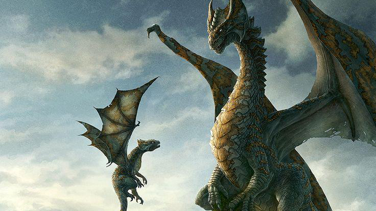
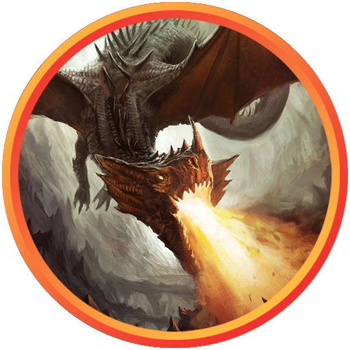
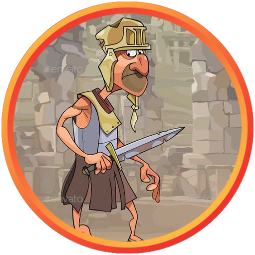
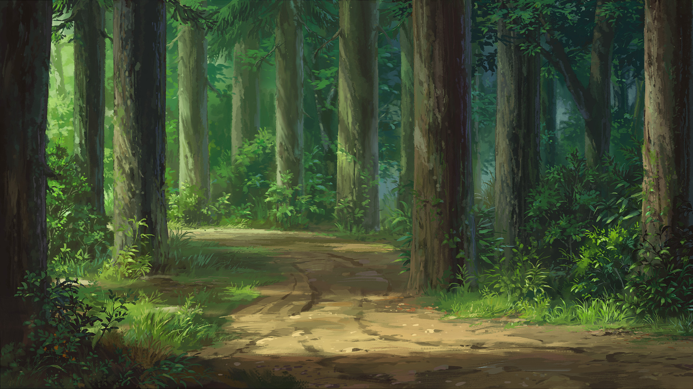
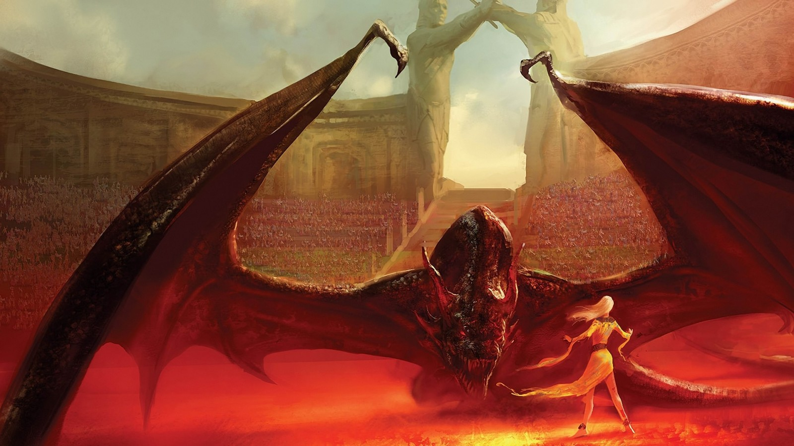

# Damsels and Dragons

## Summary
The players meet a child dragon, he's crying because an Evil Princess has kidnapped his mom. The players will need to set her free from the Coliseum where she is forced to fight monsters and gladiators for public's entertainment.

## Characters

 

### Kimba

 

Young dragon, an 8 year old kid (Simba, Russel from "Up").
Always curious, chattering away.

### Malinda

 
Mama dragon. Fierce and badass, but fair, gentle and loving with Kimba (Shirley Bennett).

### Cecilia

 
Evil Princess. Spoiled teenager. Sent countless men to die capturing the dragon just to have a pet (Jasmine from Twisted.)

### Edgar

 
The Captain of the Guards. Sick of his job, his honor makes him follow the Cecilia's orders, but his common sense tells him that it's a horrible idea most of the time.

### Alatar

 
An ancient court wizard, sycophant, always flatters the princess (Professor Farnsworth.)

## Scenes
## Meet Kimba

Players walk through the forest, and hear the sad roars in the distance. 

> You have been traveling together for awhile, passing the fields, rivers, and small villages. Now you're walking down a narrow road through the shady forest, it’s quite quiet and peaceful. Suddenly, you hear a roar in the distance, then again - a little louder this time. It seems to be coming from the direction you’re headed.

It's a crying child dragon:

> Ahead of you, you see a few sun rays breaking through the trees - a clearing. The roars are coming from that direction. "Raaaawwwwrrrr!!!"  
> You come to the edge of the clearing. In the middle of it - holy pony, is that a dragon? Certainly looks like one - bronze skin, scales, wings - all there. Not a large one though, about the size of an elephant, it seems to be very young. It has curled up in the middle of a clearing. It notices you, slowly lifts his head, and howls. Strangely sad, heartwrenching sound. Is it crying?

He's sad because evil people took his mama:
> **Kimba:** "Are you here to take me, like they took my mama?"  
> "They took my mama! The bad people! They took her away! I'm all alone now."  
> "The warriors! In black armor, with big swords and spikes! She fought so hard to protect us, but they attacked her, and cast spells on her, and, and, and they captured her! And chained her, and put her in a cage, and took her away!"

If players offer to help:
> The dragon looks at your faces, clearly confused. "You're so nice! My name is Kimba. My mom's name is Malinda. She's really kind and brave and strong! She's the best dragon."  

## Finding the City of Lyra
Kimba doesn’t know where they took his mom, only the direction. 

It's easy to find tracks left by the fight, and an army of warriors and wizards dragging the enchanted dragon into the city. Exploring around the forest will also reveal the road to the north, leading to the city.

> In the distance you see the city with tall walls of yellow stone and beautiful white towers.

## Yeti Hunters
On their way to the city, the players will see a group of warriors delivering a gigantic iron cage to the city, inside - a gigantic Big Foot.

The warriors can tell them that they're gathering creatures on the Princess Cecilia's orders - the young princess likes watching monsters and gladiators fight her new dragon at the Coliseum in the center of the city. Many good men died on this quest.

## Getting into Coliseum
There's a long queue of nobles on their way to watch the today's show (the spectacle is just for the rich). Players can fake being nobles, talk their way into the coliseum, bribe the guards, or try to sign up as Gladiators and go through The Pits.

## The Pits
If players choose to sign up as Gladiators - they'll see many captured people and monsters sitting in the cages in "The Pits" underneath the coliseum, forced to fight the dragon.

Cages are guarded by City Guards, it's possible to steal the keys from them, liberate the gladiators/monsters, and incite the rebellion.

## Coliseum Arena

At the arena they will see a gigantic dragon, she is exhausted and wounded from many fights, desperately battling the newly delivered Yeti. The dragon has a heavy enchanted chain around her neck, visibly glowing and preventing her from spewing fire onto the stands and the guards.

The stands around the arena are filled with noblemen. There's a rich tent where the Princess Cecilia, her guards, Captain Edgar, and her court wizard Alatar are sitting. Alatar is the one controlling the chain around the dragon's neck.

It's possible to distract Alatar, convince the princess to let the dragon go, or defeat them in a fight. Captain Edgar is a powerful warrior, Alatar is a powerful mage. Edgar can be convinced to take the player's side by appealing to decency/honor/reason, Alatar will follow whoever's in power at the moment.

The King isn't present, he's currently conquering some far away kingdom, if something happens to the princess he will be furious.

## Liberate Malinda
Malinda is enraged, confused, shooting fire breath in random directions. Wants to murder everyone on the stands (mention that there are kids there), doesn't realize that players are there to help.

It's difficult to persuade a raging dragon. The players will need to find some way to get her attention and make it clear that they're trying to help. If the players took Kimba along with them and Malinda sees him, it will be much easier.

If it becomes clear that players are trying to liberate her - the guards, Edgar, and Alatar will attack.

If players have liberated the Gladiators and persuaded them to incite the rebellion - they will help.

Once the chains are broken, Malinda will want to attack the audience. Persuade her not to slaughter the people. If she calms down, she will be willing to let the players ride on her back and fly them out of the city.

## Dragon Cave
Kimba and Malinda are reunited and happy. Malinda will bestow valuable treasure onto the players from her hoard, and will be willing to help them out on future adventures.
