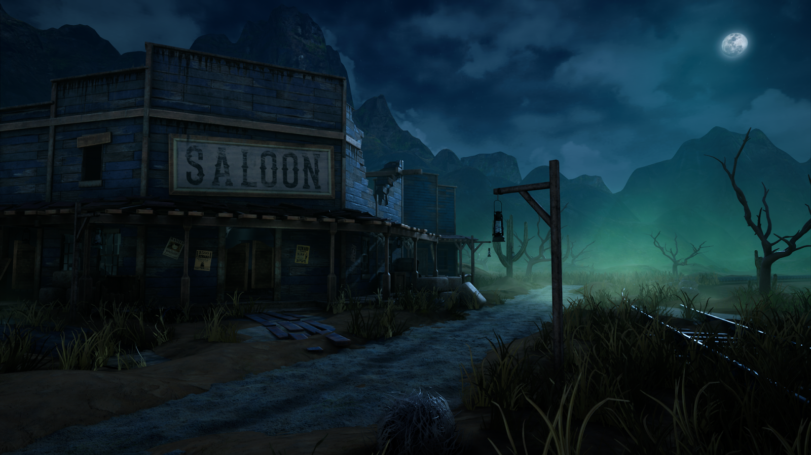
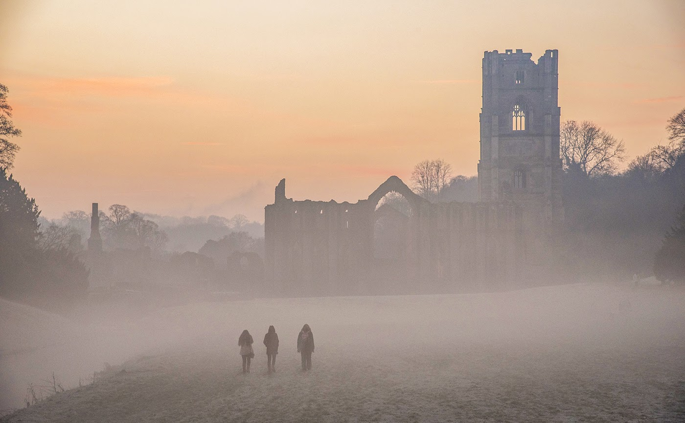
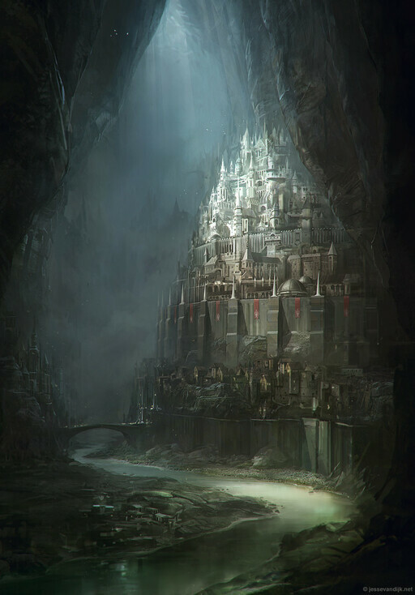
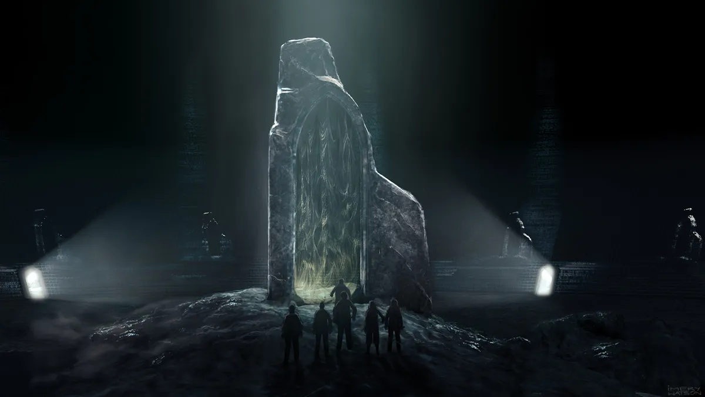

# From The Great Beyond

## Summary

Freevale, the Town of Outcasts, is being terrorized every night by the monsters from beyond - zombies, ghosts, giant centipedes, huge sentient spiders, etc.

This happens ever since the townspeople have sent an expedition to the Dead Dwarven City nearby. Underneath the city, the expedition has discovered the Gate to The Great Beyond. They took the Golden Key from it, accidentally unseailng the ancient portal to the "other side".

To save the town, the heroes must take the Key back to the portal and seal it again, once and for all.
    
## Setting

### Freevale, the Town of Outcasts
Wild-West-style town where rejects from society (tieflings, orcs, goblins, mutants, werewolves) live together in peace.

### An Old Abbey
The only place on the way to the Dead City where players can hide from the monsters. Has an old cemetery nearby.

### The Big Tusk
An Orc settlement close to the entrance to the Dead City, destroyed by the monsters coming out of the portal.

### The Empty Jewel
An abandoned underground Dwarven city.

### Portal Room
A round chamber deep underneath the ground, a spiral staircase leading to the Gate to The Great Beyond.

## Characters

### Mayor Wolfington
Mayor of the Freevale. He's a werewolf, fighting the best he can to protect the city from the monsters.

### Old Man McQue
The last survivor of the expedition. He ran away in fear, abandoning his friends, and is now wrecked by guilt.

### Orc King
Living in The Big Tusk, so close to the source of the monsters, and having lost all of his friends to the attacks, he has lost his grip on reality, and declared himself the "King fo Zombies". He trained a few zombies to serve him, and got accustomed to being the only living creature in the town.

## Scenes

### Mayor's Office

Mayor Wolfington is having a bad week. The adventurers he has summoned to his office are his last hope - he can't hold off the scourge of the monsters on his own. He tells the players about the expedition, and gives them the location of the last survivor's house, their only lead.

### Survive the Night

As players make their way to the Old Man McQue's house, the night falls. 

> ### Giant Centipedes  
> In the darkness between the buildings, you hear a pitter-patter of hundreds of tiny legs, and then see five glowing red dots - eyes of the giant centipede crwaling on the wall of the building. The sounds get louder, more are coming.

Players can hide out inside the Old man McQues house, if they persuade him to overcome his fear and lower the defences around the house for them to come in.

He will tell them about the expedition and give them the Golden Key they can use to close the Gate.

### An old Abbey

During the two day's journey towards the Gate, players can camp out inside the Old Abbey. At night, Zombies will rise from the cemetery nearby.

### The Big Tusk

The heroes will meet the Orc King. He will try to turn them into his zombie-minions, but can be convinced to help them on their mission (he can be easily fooled).

### Abandoned Dwarven City

 

The Empty Jewel is filled with various otherworldly monsters wondering about, the most dangerous of which are giant interdimensional sentient spiders. The spiders know the way to the gate, and can be negotiated with. 

### The Portal Room
The portal room is hidden behind a set of illusionary walls.

In the portal room, the heroes will see an enormous Basilisk crawling out of the Gate. If given a chance, it will swallow the player holding the Key. Once the Viper is defeated and the Key is recovered, players can put it back into place, seal the Gate, and return to Freevale victorious.

---

## Story Games

We are a group of people who love improvisation and freeform roleplay. We go on imaginary one-shot adventures in a lighthearted atmosphere with other friendly and creative people. 

We improvised this adventure from scratch, during our game. We create our characters, decide what adventure we want to go on, and then take turns GMing scenes for each other, trying to make up a fun story as we go. Think of it as a combination of freeform roleplay, brainstorming, and improv.

We're looking for some friendly and creative people to join us!

If that sounds like fun - come take a look at the very short and simple [rules](https://rpgadventures.io/story-games) to learn more, and come [play with us](https://discord.gg/gNrJJNMuyD)!

**Authors:** @Hearsay, @Maeloki, @RedFire, @lumen.

