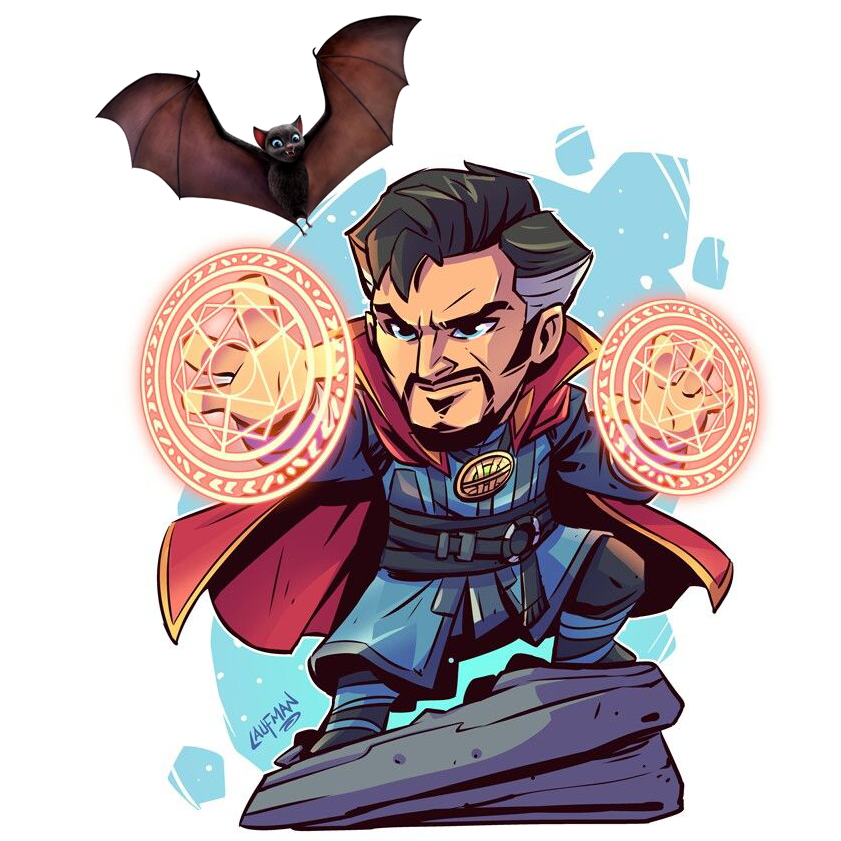

import header from './salazar/salazar-header.png';
import token from './salazar/salazar-token.png';
import faust from './salazar/faust-green-small.png';
import vincent from './salazar/vincent-malfoy.png';

# Salazar Von Neumann

### Appearance
A slender figure clad in flawlessly elegant black robes. Most of his… lets say face, is cloaked in shadows underneath his hood, you can only make out an outline of a bizarrely angular charred skull and the two piercing emerald green flames of his eyes, burning within the empty eyesockets. He is Undead.

To avoid freaking people out with his unusual appearance, he often uses his Cloak of Disguise to appear as as Vincent Everett, his fake persona:

### Personality
Salazar is intelligent, curious, cunning, and ambitious. He can often come across as arrogant and condescending (because he is).

### Backstory
Once upon a time, he was a talented young arcane researcher, consumed by the great ambition — to invent the recipe for the Philosopher's Stone. This legendary substance was going to cure every ailment known to mankind, including aging and death. He has made a lot of progress, but got a little carried away with his experiments, needed to conquer this and that to aid in his research, and ended up being a dark overlord, the glorious ruler of Stellarmir.

Then his ambitions suffered a little setback. He was slayed by a pesky ragtag band of brave adventurers. His ingenuity has allowed him to survive his death, but he has lost most of his powers, and memories.

### Ambitions
Now that he’s back to life, he wants to uncover the mystery of his past, gain back his memories, and, of course, conquer death once and for all.

He also has many issues with how the world is organized. Everything would be so much better if the people running things had a modicum of rational thought in them. But soon enough the universe will have the right person in charge.

> "The world is a mess and I just need to rule it.”

### Faust
Salazar also has a charming demon-familiar named Faust.

