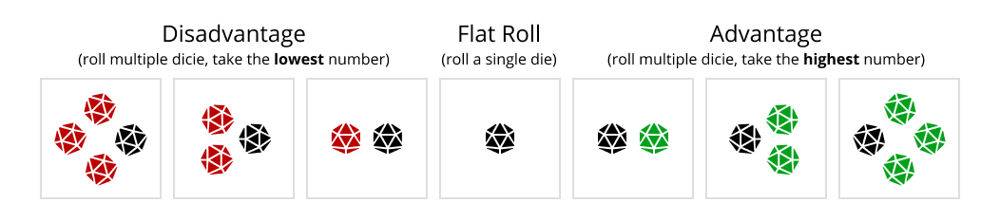

import { Link } from "gatsby"

# Dice Rolling Rules

Mirage can be played either with or without the dice, depending on your preference.

In the diceless version, the GM simply uses their judgement to decide the outcomes of the player's actions. But if you want, you can use the simple dice rolling rules to add randomness and unpredictable outcomes to your game.

To play with the dice, you will need four 20-sided dice for each player (but you can get by with the four dice for the whole group). If you're playing over discord - you can use Avrae bot to roll the dice for you automatically (instructions below).

----

## Rolling Dice (For Players)

When you attempt to do something difficult or risky, the GM will tell you to roll one or more 20-sided dice (also called **d20**). The number you roll will determine the result of your action:

- **20** - **Triumph**  
You succeed in an exceptionally spectacular way.  
If you’re dealing damage, double it.
- **15-19** - **Success**  
You successfully perform the action you were attempting.
- **7-14** - **Success at a cost**  
You succeed, but suffer some negative consequence, complication, or a setback.
- **2-6** - **Failure**  
You fail, and suffer some negative consequence, complication, or a setback.
- **1** - **Disaster**  
You dramatically fail and things get worse. You might suffer a severe setback, lose equipment, take damage from an enemy counterattack, or face some other misfortune.

An easy way to remember this:

- If you roll **7 or higher** - you succeed at an action, otherwise you fail.
- If you roll **14 or lower** - your action also leads to some negative consequence, complication, or a setback.

### Advantage and Disadvantage
Depending on the difficulty of the task, the GM can tell you to roll several (2, 3, or 4) dice with "**Advantage**" or "**Disadvantage**". You will have Advantage when the task is relatively easy, likely to succeed, or when you came up with a clever/creative approach to solving it.  You will have Disadvantage on partiularly difficult tasks. The harder the task - the more Disadvantage you'll have.

 

- If you have **Advantage** - use the **highest** one of the rolls and ignore the rest.
- If you have **Disadvantage** - use the **lowest** one of the rolls and ignore the rest.

For example, if GM tells you "Roll 3 Dice with Advantage", and you roll **4**, **17**, and **9**, your result is **17**. If GM tells you "Roll 2 Dice with Disadvantage" and you roll **5** and **16**, your result is **5**.

### Bonus Dice

Bonus dice allow you to improve your chances. Each bonus die allows you to add one advantage die or remove one disadvantage die.

There are 3 ways to gain bonus dice:

 

- **Using Powers**  
Use an ability, spell, or an item relevant to the task you are attempting.
- **Being Creative**  
Creatively use the world around you, find some clever way to approach the task to maximize your chances, or use teamwork to accomplish the task together with other players (describe how you're helping each other out).
- **Excellent Roleplaying**  
Act out a dramatic moment, make a speech, describe what you do in an exceptionally vivid and awesome way.

Each one of these options can give you at most 1 bonus die, so you can have at most 3 bonus dice in total.

When you're attempting an action, before making a roll, describe what you're doing to gain the bonus dice. The GM will tell you if what you do allows you to gain the bonus dice. 

### Rolling Dice on Discord

Our [discord server](https://discord.gg/zt4N23d) has a list of commands you can use to roll the dice automatically. To add these commands to your own server, use <Link to="/avrae-setup">this guide</Link>.

Type the command in the chat to make a roll:

- `!rl` - roll 1 die (Flat Roll).
- `!adv2` - roll 2 dice with Advantage.
- `!adv3` - roll 3 dice with Advantage.
- `!adv4` - roll 4 dice with Advantage.
- `!dis2` - roll 2 dice with Disadvantage.
- `!dis3` - roll 3 dice with Disadvantage.
- `!dis4` - roll 4 dice with Disadvantage.

----

## Rolling Dice (For GMs)

Tell players to roll the dice only in high stakes, meaningful, dramatic moments when both succeeding and failing at the action could each contribute something interesting to the story. If the roll result doesn't lead to the significant consequences, or if the failure roll doesn't have anything interesting to contribute ("nothing happens") - don't call for a roll, just make the judgement yourself.

To modify difficulty, tell the player to roll multiple dice (2, 3, or 4). For example, for extremely difficult tasks tell them to roll 4 dice with disadvantage. For extremely easy tasks, tell them to roll 4 dice with advantage.

In combat, the weapons deal static damage and hit automatically, so rolling dice every turn isn't necessary. Call for a die roll only when there's a reason the attack would be extra difficult/risky, or when it's interesting to have an unpredictable outcome.

The spells never fail to work. Outcomes and results can depend on a roll, but if the player casts a spell, the spell is going to go off and do what it's description says.

Don't hide information behind the roll. If the player describes looking for clues - they find them.

To give you some intuition on how advantage and disadvantage modify the likelihood of player's success, here are the chances of rolling "Complete Success" or higher, and "Success at a Cost" or higher:

<!-- 
|                          | Complete Success | Success at a Cost |
|--------------------------|------------------|-------------------|
| 4 Dice with Advantage    | 76%              | 99%               |
| 3 Dice with Advantage    | 66%              | 97%               |
| 2 Dice with Advantage    | 51%              | 91%               |
| 1 Dice (Flat Roll)       | 30%              | 70%               |
| 2 Dice with Disadvantage | 9%               | 49%               |
| 3 Dice with Disadvantage | 3%               | 34%               |
| 4 Dice with Disadvantage | 1%               | 24%               |

 -->
<!-- 
## Changing the Stakes
One more way to have control over the difficulty of the tasks and outcomes of the rolls is to change the meaning of "Success" and "Failure", and "Complication".

Multiple rolls
 you could break the task down into multiple rolls, thus decreasing the chance they'll succeed at all of them
so maybe for (2), it's just one roll to convince a sleazy guard to take a bribe. to convince a pious priest, it's one roll to convince them the act of taking a bribe isn't inherently sinful. then another to convince them they won't get in trouble. then a last to actually get them to take it and not turn you in later.

"change the stakes"
threat level

focus on "what happens if you fail".

Oh, that's the other thing: 10+ doesn't mean "unmitigated success at whatever you wanted to do" - it means "the best outcome you could have reasonably hoped for". If something is very, very hard, a 10+ is only going to get you one step in that direction

https://rpg.stackexchange.com/questions/19011/how-does-failure-work-in-dungeon-world-how-does-it-move-the-story-forward

6- isn't "failure" - it's "trouble".
If the PCs have to climb a fence, they're just going to keep trying until they succeed, right? So even in traditional games, many GMs will read "failed" rolls as a lack of some quality - not fast enough, not quietly enough, not without hurting themselves, etc., instead of just keeping them on the wrong side of the fence.

This is because failure is boring and stops moving the story forward. So you are correct, there is no plain-old failure in DW. It's not in the GM's agenda to make the PCs fail. There is no move for failure.

static failure doesn't exist in Dungeon World.

 -->
